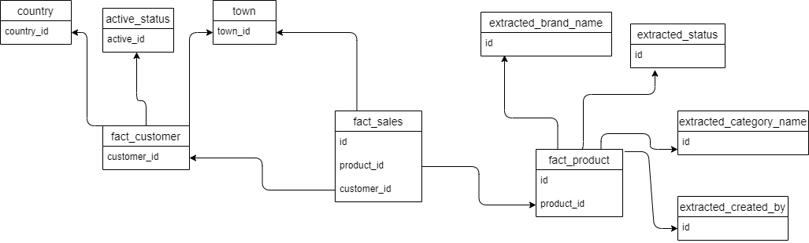
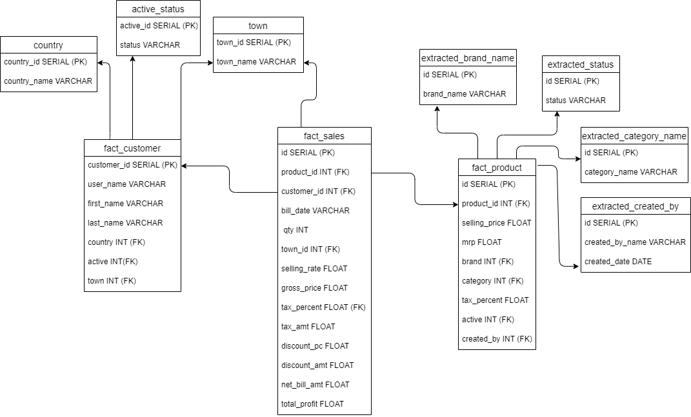
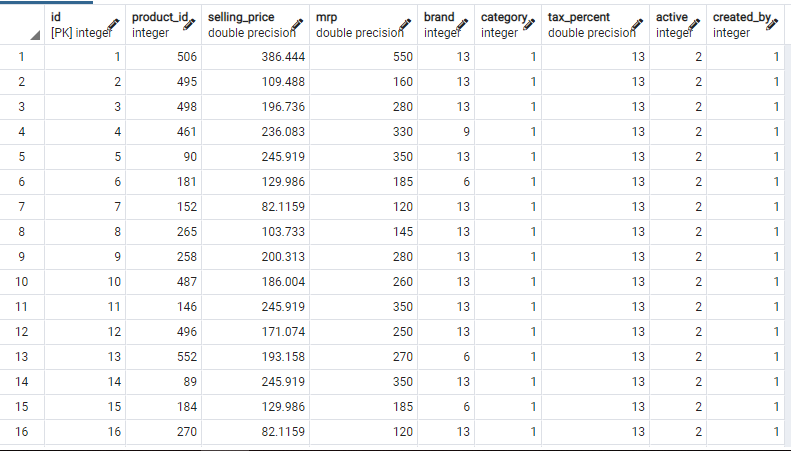
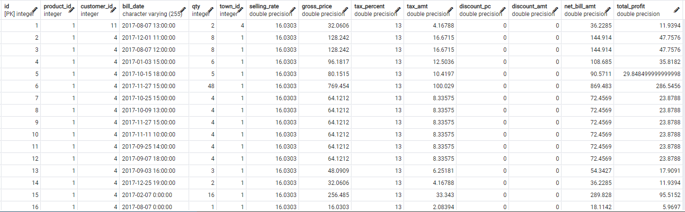

# E-commerce
E-commerce is the activity of electronically buying or selling of products on online services. It draws on technological advancemant. It draws the automation on data collection system. For the analysis of such a drven unmanaged data, a well prepared database is required so that we can get the insight through the collected data. So, I have tried to develope a datawarehourse that will help the investor to invest in such product which are fast selling and also those product which will produce high profit by removing the product that are not doing so good. For developing such dataware house I have choosed `fact constellation schema` that contains 3 fact tables. They are :: 
- fact_sales
- fact_product
- fact_customer

## Requirements:
- The datawarehouse must be able to extract those data which are most sold.
- The datewarehouse must be able to extract the town in which the specific product are sold most. 
- The datawarehouse must be able to so which customer is most frequent and buys which product.
- The dataware house must be able to show the total profit in selling the product.

## Conceptual Design

[image_link](https://drive.google.com/file/d/13r_n7prWbiLw8PLytUU0u6ABN46CZyng/view?usp=sharing)

## Physical Design

[image_link](https://drive.google.com/file/d/13r_n7prWbiLw8PLytUU0u6ABN46CZyng/view?usp=sharing)

# Physical Implementation

## Setting up the setup for managing the relative path
Initially for  importing the packages using relative path I have install the setup.py file using following command
    pip install -e .
This will find all the packages and setup it to the project

## Establishing Connection:
For establishing the connection with postgresql database we used the psycopg2 package. 

## Utils package
The utils package includes the codes which might get repeatedly called during the execution of program. It includes:
### connect() ###
    This function will connect to the postgres database.
### sql_path(path)
    This fuction will read the sql from the sql path and return it to the program.

## Creating the schema:
Here I have maintained different schema for each fact table named to `product, customer, and sales`.
### product schema
In product schema I have created the required tables for extracting the clean data and sotre it to a fact table. List of tables created in this schema are listed below.

- raw_product_dump :: stores the raw data
- extracted_product_name :: stroes the product name
- extracted_brand_name :: stores the brand name
- extracted_category_name :: store the product category name
- extracted_created_by :: store name of user
- fact_product :: acts as the fact table of product

### Customer schema
In customer schema I have created the required tables for extracting the clean data and sotre it to a fact table. List of tables created in this schema are listed below.

- raw_customer_dump :: stores the raw data of customer
- extracted_customer :: stores the cleaned data of customer 
- country :: stores the data of country
- town :: stores the data of town
- active_status :: stores the status of the customer
- fact_customer :: stores the fact details of customer table.

### Sales schema
In sales schema I have created the required tables for extracting the clean data and sotre it to a fact table. This schema acts as the central fact table of the datawarehouse. List of tables created in this schema are listed below.

- raw_sales_dump :: stores the raw details of sales data
- extracted_created_by :: store the details of user who have made entry in the system.
- extracted_sales :: store the cleaned data of the sales table.
- fact_sales :: stores the fact details of sales table.

## For product schema
While inserting the raw data into the product schema and processed we got result as:
### raw_product

### fact_product

## For customer schema
While inserting the raw data into the customer schema and processed we got result as:
### raw_customer

### fact_product

## For sales schema
While inserting the raw data into the sales schema and processed we got result as:
### raw_sales

### fact_sales

Here in fact_sales table, we can get that on a perticular date, specific customer bought the specific product_id product in a specific town. Also we can get the net profit gained on the particular date on particular product which will suggest to invest on such product in future which are sold more and which generates more profit according to present days selling rate. Thus, it satifies the above mention requirements.