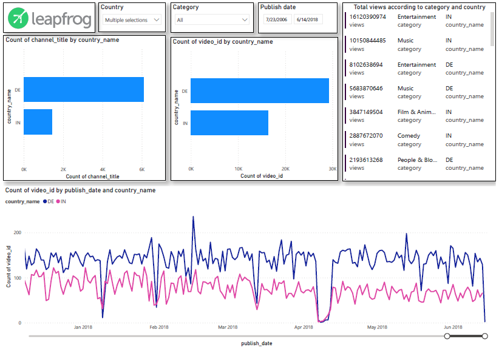
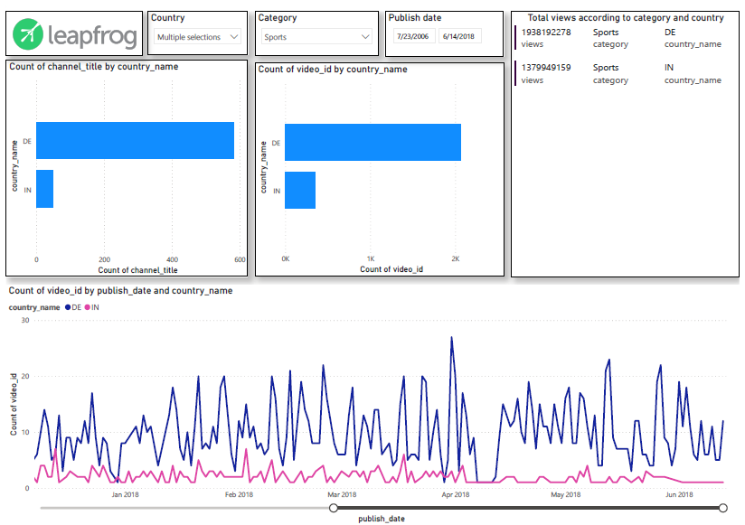

<h1> <b><u><p style = "text-align : center;"> YouTube Trend Analysis </u></b></p></h1>

# Introduction
<p style = "text-align : justify;"> YouTube is a widely used and famous online video platform in the world today. YouTube has a list of trending videos that is updated constantly. Analyzing these trending videos can give content creators greater perspective and knowledge for increasing their popularity and category of their channels. Any company and business using social media and digital platform can also use this analysis to bust their growth in business by publishing videos in approprate channel and category at right time. </p>

# Objective
<ul><li> to understand the trending channel and category</li>
<li> to understand the timeshift to upload video for possible highest views
<li>to understand average days for video getting in trending</li>
<li>to understand the trend of views, likes, dislikes, comments in contents of specific category and channel
</ul>

# Dataset
<p style = "text-align : justify;"> For handelling the project, I have chosen the dataset from kaggle. The dataset includes 20 files: 10 csv files for 10 different countries and 10 json files as the supportive file for csv files. The json file includes the details of the category of the items in the csv file. Each CSV file consists of 10 columns (video_id, trending_date, title, channel_title, category_id, publish_time, tags, views, likes, dislikes).  As the supportive file, each CSV file has an individual JSON file containing the details of the category.</p>

[Click Here for Dataset](https://www.kaggle.com/datasnaek/youtube-new) 

# Methodology
## Data Flow Diagram
Each data files (csv/json) are used for the ETL process after which the dimension and fact table as shown in figure below.

[Detail Image Link](https://drive.google.com/file/d/1ih9o-XFHq1VjkB524T2Tppntpbi7If2t/view?usp=sharing)


## Data Import process into database
<p style = "text-align : justify;">Basically, I have used bulk import strategy directly from csv file and bulk import from JSON using the pandas and json package from python. Each csv and json files has been dumped to raw_video_detail, raw_category respectively. Each data files imported to database in VARCHAR datatype. This is because the data format of source data may change over time so that later on they can be easily transformed as per the requirements. </p>

code for copying csv data to database
```
EXECUTE FORMAT(
        'COPY raw_data.raw_video_detail
        FROM %L
        (
        DELIMITER '','',
        FORMAT CSV,
        ENCODING ''LATIN1'');', abs_path_of_csv);
```


<p style = "text-align : justify;">Here the abs_path_of_csv is the absolute path for csv file.The type of format conversion is used to produce the format specifier's output. The following types are supported in postgres:</p>
<ol>
<li>

`%s` <p style = "text-align : justify;">formats the argument value as simple string. A null value is treated as an empty string.</p>
<li>

`%I` <p style = "text-align : justify;">treats the argument value as an SQL identifier, double-quoting it if necessary. It is an error for the value to be null.</p>
</li>
<li>

`%L` <p style = "text-align : justify;">quotes the argument value as an SQL literals. A null value is displayer as the string NULL, without quotes.</p>
</li>
</li>
</ol> <br>

Code for reading json file, extract required attribute from nested json and inserting it into database.
```
    kind, etag, category_id, assignable, category, channel_id = [], [], [], [], [], []
    data = pd.read_json(single_path)
    #extracting kind, etag, channelID, assignable, category and id from entire individual json file
    for item in data['items']:
        kind.append(item['kind'])
        etag.append(item['etag'])
        category_id.append(int(item["id"]))
        channel_id.append(item['snippet']['channelId'])
        category.append(item['snippet']['title'])
        assignable.append(item['snippet']['assignable'])
    
    new_data = pd.DataFrame({'kind':kind, 'etag':etag, 'category_id':category_id, 'channel_id':channel_id, 'category':category, 'assignable':assignable})
    engine = create_engine('postgresql://postgres: @localhost: 5432/youtube')
    new_data.to_sql('raw_category', engine)
    engine.dispose()
```
`Here the single_path is the relative path to the json file.`

## Archiving the raw tabels
<p style = "text-align : justify;"> For each csv file, once it read and copied the data into database. The raw_video_detail table get altered with addition of country field to store the country code, extracted from the file name. Then all the data from altered raw_video_detail is selected and inserted to raw_archive_video_detail table. In which the data will get inserted if there exists no any specific video_id and publish_time previously.

```
INSERT INTO raw_data.raw_archive_video_detail(video_id, trending_date, title, channel_title, category_id, publish_time, tags, views, likes, dislikes, comment, thumbnail_link, comments_disabled, ratings_disabled, video_error_or_removed, description, country)
    SELECT *
    FROM raw_data.raw_video_detail WHERE video_id 
    NOT IN (SELECT video_id FROM raw_data.raw_archive_video_detail WHERE country = %L)
    AND publish_time NOT IN (SELECT publish_time FROM raw_data.raw_archive_video_detail WHERE country = %L)', country_name, country_name);
```

Then the alter raw_video_detail table again get altered with deletion of the country column so that the data from next csv file will get inserted to the same table after `TRUNCATE`.

While archiving the raw_category table, simply select all the data from raw_category table and insert it into the raw_archive_category table in which, the category and category_id must not be previsously present in archive table. If it exists, the data will not get inserted to archive table.
```
INSERT INTO raw_data.raw_archive_category(kind, etag, category_id, channel_id, category, assignable)
                       SELECT kind, etag, category_id, channel_id, category, assignable
                       FROM raw_category WHERE category_id NOT IN (SELECT cast(category_id as int) FROM raw_data.raw_archive_category)
                        AND category NOT IN (SELECT category FROM raw_data.raw_archive_category);
```

</p>
<p style = "text-align : justify;">
Actually, for csv file, stored procedures named raw_data and raw_video_detail(abs_path_of_csv text, country_name text) are implemented for following steps:
<ul>
<li>bulk insert of data from csv file</li>
<li>altering the raw_video_detail table and adding new column country</li>
<li> setting the country column with the country code(which is passed as parameter)</li> 
<li>selecting all the data from raw_video_detail table and inserting it to archive table</li>
<li>finally re-alter the raw_video_detail table by dropping the country column and make the table ready to get next data from next csv file.</li>
</p> 

```
CREATE OR REPLACE PROCEDURE raw_data.raw_video_detail(abs_path_of_csv text, country_name text)
    LANGUAGE plpgsql
AS
$$
BEGIN
        EXECUTE FORMAT('TRUNCATE TABLE raw_data.raw_video_detail RESTART IDENTITY CASCADE');
        
        EXECUTE FORMAT(
        'COPY raw_data.raw_video_detail
        FROM %L
        (
        DELIMITER '','',
        FORMAT CSV,
        ENCODING ''LATIN1'');', abs_path_of_csv);
        
        EXECUTE FORMAT('ALTER TABLE raw_data.raw_video_detail
                        ADD country VARCHAR');
        
        EXECUTE FORMAT('UPDATE raw_data.raw_video_detail SET country = %L WHERE country IS NULL', country_name);
        
        EXECUTE FORMAT('INSERT INTO raw_data.raw_archive_video_detail(video_id, trending_date, title, channel_title, category_id, publish_time, tags, views, likes, dislikes, comment, thumbnail_link, comments_disabled, ratings_disabled, video_error_or_removed, description, country)
                       SELECT *
                       FROM raw_data.raw_video_detail WHERE 
                       video_id NOT IN (SELECT video_id FROM raw_data.raw_archive_video_detail WHERE country = %L)
                       AND publish_time NOT IN (SELECT publish_time FROM raw_data.raw_archive_video_detail WHERE country = %L)', country_name, country_name);
        
        EXECUTE FORMAT('ALTER TABLE raw_data.raw_video_detail DROP COLUMN country');
    END;
$$;
```

## Transformation 
<p style = "text-align : justify;">
While tranforming the data, I have basically transformed the datatype of necessary data from archive table data to required datatype. On transforming the data of raw_archive_video_detail table, specifially I have: <br/>
- cleaned the video_id starting with _ and __ <br/> 
- cast the trending_date to DATE format <br/>
- normalize the table to 1NF by seperating the publish time and publish date <br/>
- cast the publish_time to TIME format <br/>
- cast the publish_date to DATE fromat <br/>
- views, likes, dislikes and comments are casted to BIGINT format <br/>
- comments_disabled, ratings_disabled, and video_error_or_removed are casted to BOOLEAN format. <br/>
After transforming the above mentioned field, I have inserted , video_id, trending_date, title, channel_title, category_id, publish_date, publish_time, views, likes, dislikes, comments, comments_disabled, ratings_disabled, video_error_or_removed and country field to transformed_video_detial table. <br/>

```
INSERT INTO transformed.transformed_video_detail(video_id,trending_date,title,channel_title,category_id,publish_date,publish_time,views,likes,dislikes,comments,comments_disabled,ratings_disabled,video_error_or_removed,country)
SELECT
CASE WHEN video_id LIKE '--%%' THEN RIGHT(video_id, LENGTH(video_id)-2)
   WHEN video_id LIKE '-%%' THEN RIGHT(video_id, LENGTH(video_id)-1)
   ELSE video_id
   END AS video_id,
TO_DATE(trending_date, 'yy.dd.mm'),
title,
channel_title,
CAST(category_id AS INT) AS category_id,
publish_time::TIMESTAMP::DATE AS publish_date,
publish_time::TIMESTAMP::TIME AS publish_time,
CAST(views AS BIGINT) AS views,
CAST(likes AS BIGINT) AS likes,
CAST(dislikes AS BIGINT) AS dislikes,
CAST(comment AS BIGINT) AS comments,
CAST(comments_disabled AS BOOLEAN) AS comments_disabled,
CAST(ratings_disabled AS BOOLEAN) AS ratings_disabled,
CAST(video_error_or_removed AS BOOLEAN) AS video_error_or_removed,
country
FROM raw_data.raw_archive_video_detail WHERE video_id <> 'video_id' ;
```

For the raw_archive_category table, transformation has been applied directly while making the dimension table. Here also I have applied the datatype transformation. 
</p>

## Validation
<p style = "text-align : justify;">
Validation is an essential part of ETL. The result depends upon the accuracy of the data. If the data isn't accurate at begining, the result definitely will not be accurate either. Thus some validation are applied after archieving raw data, some after transformation steps and some after the dimension. Some validations used are as follows:
<ol> 
<li> raw_archive validation </li>
<ul>
<li>caetegory_id</li>

```
SELECT
   *
FROM
   raw_data.raw_archive_category
WHERE
   category_id ISNULL
   OR (
      category_id IS NOT NULL
      AND category ISNULL
   );
```

<li>existence of video_id without publish date</li>

```
SELECT
    *
FROM
    transformed.transformed_video_detail
WHERE
    video_id IS NOT NULL
    AND publish_date ISNULL;
```

<li>validate video_id</li>

```
SELECT
    *
FROM
    raw_data.raw_archive_video_detail
WHERE
    video_id ISNULL
    OR title ISNULL;
```

<li>negative likes, dislikes, comments, views</li>

```
SELECT
    *
FROM
    transformed.transformed_video_detail
WHERE
    CAST(views AS INT) < 0
    OR CAST(likes AS INT) < 0
    OR CAST(dislikes AS INT) < 0
    OR CAST(comments AS INT) < 0;
```

</ul>
<li>Transformation Validation </li>
<ul>
<li>trending_date < publish_date</li>

```
SELECT
    *
FROM
    transformed.transformed_video_detail
WHERE
    publish_date > trending_date;
```

<li>publish time > 23:59:59 </li>

```
SELECT
    *
FROM
    transformed.transformed_video_detail
WHERE
    publish_time > '' 23 :59 :59 '' :: TIME;
```

<li> existance of category_id in transfromed table which are not in archive table </li>

```
SELECT
    CAST(category_id AS INT) AS category_id
FROM
    transformed.transformed_video_detail
EXCEPT
SELECT
    CAST(category_id AS INT) AS category_id
FROM
    raw_data.raw_archive_video_detail;
```

<li>existance of comments though the comments_disabled is true</li>

```
SELECT
    *
FROM
    transformed.transformed_video_detail
WHERE
    comments_disabled = '' True ''
    AND comments > 0;
```

</ul>
<li>Dimension Validation</li>
<ul>
<li>check for the existance of negative days_for_trending </li>

```
SELECT
    *
FROM
    dimension.dim_date
WHERE
    days_for_trending < 0;
```

<li>checking for the existance of caetgory_id except in raw_archive_category table</li>

```
SELECT
    category_id
FROM
    dimension.dim_category
EXCEPT
SELECT
    CAST(category_id AS INT)
FROM
    raw_data.raw_archive_category;
```

</ul>
</ol>

</p>
<p style = "text-align : justify;">
ALL these script are further passed to a function named as validation_script(script text). This function will accept the validation query and return the integer value. If the returned value is not 0 the program will return the message with the termination of the program at the point. Else it signifies that the dataset is valided to the validation script and allow the program to execute further. 
</p>

```
CREATE
OR REPLACE FUNCTION validation_script(script TEXT) RETURNS INT AS $ $ DECLARE count_val INT;

stat TEXT;

BEGIN stat := format('SELECT COUNT(*) FROM (%s) result', script);

EXECUTE stat INTO count_val;

RETURN count_val;

END;

$ $ LANGUAGE plpgsql;
```

# Data Warehouse Design

## Conceptual Model of Data Warehouse

## Physical Model of Data Warehouse


<p style = "text-align : justify;">
The data warehouse is designed implementing the `Star Schema` in which `central_fact` as fact table with other six dimensions extracted from transfromed_video_details and raw_archive_category table as:</p>
<ol>
<li> dim_video</li>
<p style = "text-align : justify;">
    This dimension stores the detailed information of video_id and the title to the video_id. The surrogate key 'id' acts as the primary key which is the foreign key for central_fact table. </p>
    
    ```
    INSERT INTO dimension.dim_video(video_id, title)
    SELECT DISTINCT video_id, title
    FROM transformed.transformed_video_detail;
    ```

<li>dim_category</li>
<p style = "text-align : justify;">
    This dimension table stores the name of category and the category_id itself from the raw_archive_category along with the transformation step in same step. The category_id is the primary key to the table and  the foreign key for central_fact table. </p>

    ```
    INSERT INTO dimension.dim_category(category_id, category)
    SELECT DISTINCT CAST(category_id AS INT) AS category_id, category
    FROM raw_data.raw_archive_category;
    ```

<li>dim_channel</li>
<p style = "text-align : justify;">
    This dimension table stores the title of the channel. The surrogate key 'id' is the primary key and the foreign key for central_fact table. </p>

    ```
    INSERT INTO dimension.dim_channel(channel_title)
    SELECT DISTINCT channel_title
    FROM transformed.transformed_video_detail;
    ```

<li>dim_date</li>
<p style = "text-align : justify;">
    This dimension table will store the trending_date, publish_date and the calculated value for days_for_trending. The surrogate key 'id' is primary key and a foreign key for central_fact table. </p>

    ```
    INSERT INTO dimension.dim_date(trending_date, publish_date, days_for_trending)
    SELECT DISTINCT trending_date,
                    publish_date,
                    (trending_date::date - publish_date::date) as days
    FROM transformed.transformed_video_detail;
    ```

<li>dim_time</li>
<p style = "text-align : justify;">
    This dimension table will store the publish_time and the calculated value for publish_shift. Here, for calculating the publish_shift, I have assumed the arbitary value to differentiate the shift. I have taken the entire day to 4 shifts as:
    <ol>
    <li>Morning shift --> 00:00:00 to 10:59:59 </li>
    <li>Day shift --> 10:59:59 to 17:59:59 </li>
    <li>Evening shift --> 17:59:59 to 20:59:59 </li>
    <li>Night shift --> 20:59:59 to 23:59:59 </li>
    </ol>
     The surrogate key 'id' is the primary key  and foreign key for central_fact table. </p>

    ```
    INSERT INTO dimension.dim_time(publish_time, publish_shift)
    SELECT DISTINCT
                publish_time,
                CASE
                    WHEN publish_time >= '00:00:00'::TIME AND  publish_time <= '10:59:59'::TIME THEN 'Morning'
                    WHEN publish_time > '10:59:59'::TIME AND publish_time <= '17:59:59'::TIME THEN 'Day'
                    WHEN publish_time > '17:59:59'::TIME AND publish_time <= '20:59:59'::TIME THEN 'Evening'
                    WHEN publish_time > '20:59:59'::TIME AND publish_time <= '23:59:59'::TIME THEN 'Night'
                ELSE NULL
                END AS publish_shift
    FROM transformed.transformed_video_detail;
    ```

<li>dim_country</li>
<p style = "text-align : justify;">
    This dimension table will store the distinct country name. The surrogate key 'id' is primary key and a foreign key for central_fact table. 
    </p>

    ```
    INSERT INTO dimension.dim_country(country_name)
    SELECT DISTINCT country
    FROM transformed.transformed_video_detail;
    ```

</ol>

### central_fact
<p style = "text-align : justify;">
    Fact tables are the numerical measures which are quantitative in nature. The fact table contains the name of facts, keys to each of the related dimension tables. A fact table is composed of two or more primary keys an usually also contains the numeric data. The fact tables are often very large, containing hundreds of milions of rows and consuming huge storage. So do in this project the fact tables contains 375,942 number of rows. The data in central_fact are fetched from each dimension and the transformed_video_detail table as below:

    ```
    INSERT INTO facts.central_facts(video_id, channel_id, trending_id, category_id,
                                publish_time_id, views, likes, dislikes, comments,
                                comments_disabled, ratings_disabled, video_error_or_removed, country_id)
    SELECT vi.id,ch.id,da.id,ca.category_id,ti.id,views,likes,dislikes,comments,comments_disabled,ratings_disabled,video_error_or_removed,co.id AS country
    FROM transformed.transformed_video_detail tr
            LEFT JOIN dimension.dim_video vi ON tr.video_id = vi.video_id AND tr.title = vi.title
            LEFT JOIN dimension.dim_channel ch ON tr.channel_title = ch.channel_title
            LEFT JOIN dimension.dim_date da ON tr.trending_date = da.trending_date AND tr.publish_date = da.publish_date
            LEFT JOIN dimension.dim_time ti ON tr.publish_time = ti.publish_time
            LEFT JOIN dimension.dim_category ca ON tr.category_id = ca.category_id
            LEFT JOIN dimension.dim_country co ON tr.country = co.country_name;
    ``` 

</p> 

# Data Visualization
<p style = "text-align : justify;">
While visualizing the data, the dimension tables and the central_fact table has been used since they are all in transformed format. Three dashboard has been created showing the different factors in category, channel and country discipline. Some of the insight from these dashboard are as below:</p>
<ol>

<b><li><h3>Category Dashboard</h3></li></b>
    <p style = "text-align : justify;">In category dashboard, different chart showing the average days_for_trending by category, count of video_id by category, top 2 highest viewed, highest liked, highest disliked, highest commented categories, trend of likes, dislikes and comments in a category, average views by publish_shift and category.</p>


<p style = "text-align : center;">Fig.: Category dashboard with all category selction</p>
    <p style = "text-align : justify;">In image above we can observe the graphs for all the category in the database. This picture represent that the music category takes the highest average days for getting into the trending meanwhile the movies category takes the lowest average days to get into trending. <br/> Similarly, there is highest number of videos in Entertainment category. The music and Entertainment categories has the highest number of views, Entertainment category has highest likes and dislikes both and Music category has the highest numbe of comments. From the average of views by publish_shift and category graph, it signifies that the 'music' category has the highest number of views when it is published in 'morning shift' and 'science and technology' category has highest number of views when it is published in 'night shift' and so on. </p>


<p style = "text-align : center;">Fig.: Category dashboard with single category selction</p>
    <p style = "text-align : justify;">The figure just above shows the average days_for_trending by category, count of video_id by category, top 2 highest viewed, highest liked, highest disliked, highest commented categories, trend of likes, dislikes and comments in a category, average views by publish_shift and category for a single category(Sports category). It signifies that sports category takes 44.42 days in average to get into the trending and has 13.5K videos in this category. If the videos in this category are published in night shift it is getting the highest number of views then publihsing on other shift. </p>


<p style = "text-align : center;">Fig.: Category dashboard with multiple category selction</p>
    <p style = "text-align : justify;">Image just above shows the comparison between two categories (Sports and Comedy) in above mentioned field. It shows that the comedy category takes the highest average day for getting into trending than sports category and has highest number of videos in sports category than in comedy category. The video in sports category is better to publish in night shift for more number of views meanwhile, the best shift to publish the videos in comedy category would be evening shift. 
<b><li><h3>Country Dashboard</h3></li></b>
    <p style = "text-align : justify;">On visualizing the youtube trending data based on country, we can observe the result that which country is owning what number of channel, which country has publish what number of video till the date, which country has number of views on the category and how many videos are being published by a country in a day.<br/>
    The dashboard below shows that Mexico owns the highest number of channel while India own the lowest number of channel. Russia has published highest number of videos and Great Britain has published the lowest number of videos. The count of video_id by publish_date and country_name shows the number of videos published per day by a country which may not be appropriate to visualize the trend for all number of country. But it may be most useful for visualizing the number of videos published by a country on each day for selecting single country or multiple country. Using this graph we can analyse the differences of videos being published according to country. On analysing this graph for all the country we can observe that on 7, April 2018 to 11, April 2018 every country has published very less number of videos. Now we can go through this graph that why less number of videos are published on these days.
    </p>


<p style = "text-align : center;">Fig.: Country dashboard with all country and all category selction</p>


<p style = "text-align : center;">Fig.: Category dashboard with single country selction and all category selection</p>


<p style = "text-align : center;">Fig.: Category dashboard with multiple country selction and all category selection</p>


<p style = "text-align : center;">Fig.: Category dashboard with multiple country selction and single category selection</p>

<b><li><h3>Channel Dashboard </h3></li></b>
    <p style = "text-align : justify;">While visualizing the data based on channel, the relation between number of likes and views to the content in any category signifies the possibility of trending of the channel and the relation between views and the number of video in the channel also shows the trending possibility of the channel. <br/>
    The dashboard below shows above mentioned relation and the number of videos in each channel in the database. In which the 'ibighit' channel has almost linear likes(776812043) and views(8205572221) which is pretty good in nature. Also the 'ChildishGambinoVEVO' has only two video but has 11,016,766,510 views which is pretty good in nature because without good content the videos in this channel cannot have such a huge number of views in only 2 videos. The dashboard also shows that the SET India channel has the highest numbe of videos(251).</p>
    

<p style = "text-align : center;">Fig.: Channel dashboard with all channel selection</p>


<p style = "text-align : center;">Fig.: Channel dashboard with single channel selection</p>


<p style = "text-align : center;">Fig.: Channel dashboard with multiple channel selection</p>
</ol>


